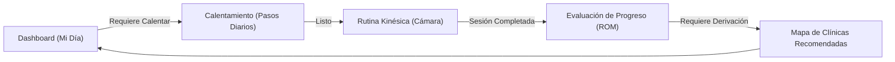

# Análisis de Unificación de UI: Estrategia de Cohesión de Experiencia

Este documento presenta un análisis UI/UX profundo sobre la fragmentación actual de la aplicación. Se diagnostica por qué se percibe como una mezcla de "distintas apps" y se propone una estrategia de diseño detallada para acoplar las funcionalidades (Pasos/Fitness, Rehabilitación con Cámara y Búsqueda de Clínicas en Mapa) en una experiencia de usuario única, fluida y premium.

---

## 1. Diagnóstico de la Fragmentación (¿Por qué se sienten como apps separadas?)

Actualmente, la aplicación sufre de una división en tres silos de experiencia de usuario independientes que no se comunican entre sí:

```mermaid
graph TD
    subgraph Silo_1 ["Silo 1: Podómetro / Fitness"]
        A[Dashboard de Pasos] --> B[Progreso de Calorías/Pasos]
        B --> C[Logros de Pasos]
    end
    subgraph Silo_2 ["Silo 2: Rehabilitación Activa"]
        D[Lista de Ejercicios] --> E[Cámara ML Kit / Ángulos]
        E --> F[Estadísticas de ROM]
    end
    subgraph Silo_3 ["Silo 3: Utilidad de Mapas"]
        G[Buscador de Clínicas] --> H[Trazar Ruta en Mapa]
        H --> I[Llamar Clínica]
    end
    style Silo_1 fill:#f9f,stroke:#333,stroke-width:2px
    style Silo_2 fill:#bbf,stroke:#333,stroke-width:2px
    style Silo_3 fill:#fbf,stroke:#333,stroke-width:2px
```

### Síntomas de la Desconexión Visual y Conceptual:
1. **Inconsistencia de Objetivos**: El Dashboard está enfocado en contar pasos diarios y calorías quemadas (estilo Google Fit), mientras que las pantallas de rutina y sesión se enfocan estrictamente en kinesiología y rango de movimiento articular (ROM). El mapa es una guía urbana de clínicas sin contexto terapéutico.
2. **Inconsistencias de Navegación e Insets**: Algunas pantallas bloquean completamente la barra del sistema (Rehab, Dashboard), otras conservan márgenes toscos y el mapa oculta la barra inferior de navegación de forma abrupta durante la carga, alterando la geometría de la UI.
3. **Ausencia de Hilo Conductor (Contexto)**:
   - Los pasos del podómetro no influyen en tu terapia física.
   - Las clínicas del mapa no están vinculadas a tu diagnóstico o rutina médica.
   - No hay una transición visual (Motion Design) que acompañe al usuario entre la tranquilidad del Dashboard, la concentración de la sesión con cámara y la navegación en la calle con el mapa.

---

## 2. Propuesta de Unificación: "El Hilo Terapéutico"

Para transformar estas tres utilidades en una sola experiencia premium, debemos redefinir el propósito de la aplicación: **"Una app de recuperación asistida e inteligente"**. En este modelo, el fitness y el mapa giran en torno al objetivo de curación del usuario.

### El Ciclo de Experiencia Unificado (User Journey Cohesivo)

---

## 3. Plan de Acoplamiento y Rediseño de Pantallas

### Eje A: Rediseñar el Dashboard como "Centro de Control de Recuperación"
El Dashboard no debe ser un simple contador de pasos general. Debe ser el núcleo donde convive tu progreso diario terapéutico.

*   **Cambio UI/UX**:
    *   **Área Superior Dinámica (Tarjeta Contextual)**: En lugar de un saludo plano, mostrar el estado actual de la terapia: *“Hola Imanol, hoy te toca sesión de Rodilla. Completa 2,000 pasos de calentamiento para desbloquear el ejercicio”*.
    *   **Integración Pasos-Rehabilitación**: Vincular los pasos diarios como fase de "Calentamiento/Warm-up". Al alcanzar una meta mínima de pasos en el Dashboard, se habilita visualmente un botón interactivo y animado: **"Iniciar Sesión de Rehabilitación"**.
    *   **Anillos de Progreso Cruzados**: Sustituir el gráfico de barras por un set de dos anillos concéntricos inspirados en el diseño premium de Apple Health:
        *   *Anillo Externo*: Progreso de pasos de calentamiento (Fitness).
        *   *Anillo Interno*: Ejercicios de rehabilitación completados hoy (Terapia).

### Eje B: Vincular el Mapa (`MapScreen`) al Proceso Terapéutico
El mapa de clínicas no debe sentirse como una sección aislada tipo "Páginas Amarillas". Debe integrarse con tu ficha médica.

*   **Cambio UI/UX**:
    *   **Clínicas Recomendadas según tu Lesión**: En la parte superior del mapa, colocar filtros rápidos contextualizados: *"Clínicas con Especialidad en Kinesiología de Rodilla"* o *"Centros sugeridos para tu tratamiento de Hombro"*.
    *   **Acciones desde el Historial de Sesiones**: Si el usuario registra una sesión con bajo rendimiento o dolor constante (ROM deficiente de forma repetida), la pantalla de Progreso o Post-Sesión debe sugerir activamente: *“Tu rango de movimiento ha disminuido. ¿Deseas buscar un especialista cercano?”* con un botón que te lleva al mapa con la clínica especializada ya seleccionada.
    *   **Guardado Inteligente**: Integrar la persistencia de la última clínica visitada directamente en el Dashboard como una tarjeta de acceso directo: *"Tu próximo turno: Clínica Ciudadela (Trazar ruta)"*.

### Eje C: Transición de Marca Visual (Color, Formas y Motion)

*   **Tipografía y Tokens de Diseño**:
    *   Unificar los estilos de tarjetas. Todas las tarjetas (`Card`) en la app deben usar el mismo radio de esquina (`20.dp`), bordes delgados semitransparentes (`1.dp` en `DarkBorder` / `LightBorder`) y un sutil fondo translúcido (Glassmorphism) en Modo Oscuro.
*   **Motion Transitions (Animaciones Contextuales)**:
    *   Al hacer clic en "Comenzar Ejercicio" en `RoutineListScreen`, no se debe realizar un cambio brusco de pantalla. La tarjeta del ejercicio seleccionado debe expandirse suavemente mediante una transición de contenedor compartido (Shared Element Transition) para convertirse en el fondo oscuro de la cámara en `RehabSessionScreen`.
    *   El paso entre el Dashboard y el progreso debe utilizar animaciones de deslizamiento horizontal consistentes, manteniendo la barra de navegación inferior fija y sin parpadeos.

---

## 4. Plan de Acción UI/UX para el Equipo

| Qué Falta Agregar | Qué Mejorar (Consistencia) | Qué Cambiar (Comportamiento) | Qué Eliminar (Ruido) |
| :--- | :--- | :--- | :--- |
| **Tarjeta Contextual de Terapia** en el Dashboard indicando el próximo paso médico del usuario. | **Contraste de colores semánticos** en Light Mode (CyanWave sobre fondo claro). | **Navegación persistente**: Mantener el BottomBar estático sin Layout Shifts durante transiciones. | **Hiding persistente de barras**: Permitir que el sistema dibuje el reloj y la batería. |
| **Filtros por especialidad médica** en el Mapa en base a los ejercicios que realiza el usuario. | **Feedback de ML Kit**: Resaltar solo las articulaciones bajo evaluación y suavizar las líneas corporales. | **Enfoque de Pasos**: Cambiar la metáfora de "fitness diario" a "calentamiento terapéutico". | **Acciones huérfanas en el mapa**: Remover clínicas ajenas al tratamiento del usuario o genéricas. |
| **Micro-interacciones Lottie**: Confeti animado al desbloquear logros en el Dashboard. | **Consistencia en Card Shapes**: Homologar elevaciones, esquinas y bordes en todo el proyecto. | **Layout inmersive (Edge-to-Edge)** completo con Padding Insets correctos en Compose. | **Greeting boilerplate** y rutas sin pantallas asignadas (`ClinicDetail`, `User`). |
